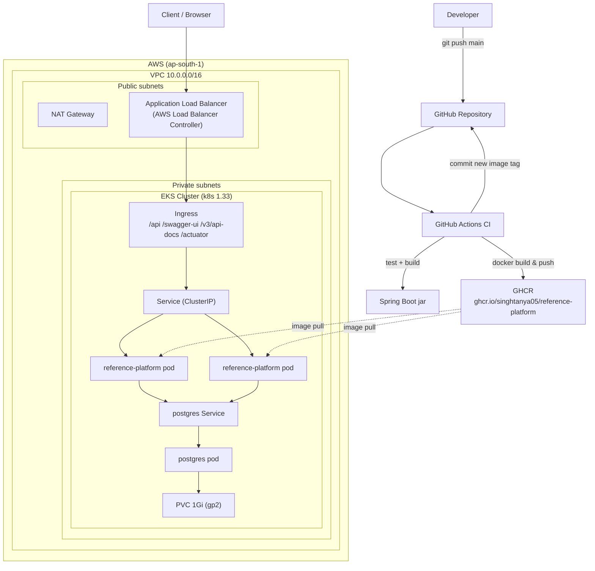

# Reference Platform

A production-style Spring Boot REST API deployed end-to-end on **AWS EKS**, provisioned with **Terraform** and shipped through a **GitHub Actions → GHCR → Kubernetes** pipeline.

The application itself (a Product CRUD API) is intentionally simple — the point of this project is the platform around it: infrastructure as code, containerization, CI, and a real Kubernetes deployment on managed cloud infrastructure.

> **Repo:** [github.com/singhtanya05/reference-platform](https://github.com/singhtanya05/reference-platform)

---

## What this project demonstrates

- **Infrastructure as Code** — VPC and EKS cluster provisioned with Terraform, using the official `terraform-aws-modules` (`vpc` and `eks`), plus the ECR repository and the AWS Load Balancer Controller's IAM role (`terraform/ecr.tf`, `terraform/irsa.tf`).
- **Containerization** — a multi-stage Dockerfile that builds a minimal, non-root runtime image.
- **CI** — GitHub Actions runs the test suite, builds the jar, builds and pushes a Docker image to GHCR, and commits the new image tag back into the Kubernetes manifests (a GitOps-style manifest update).
- **Kubernetes deployment** — Kustomize-based manifests (base + overlay) for the namespace, the app, its Postgres database, a Service, an ALB-backed Ingress, an HPA, and a PodDisruptionBudget, with startup/liveness/readiness probes and resource limits.
- **Observability** — Spring Boot Actuator health endpoints and Prometheus-formatted metrics out of the box.
- **Operational, hands-on AWS work** — the AWS Load Balancer Controller's Helm install itself, creating the two Kubernetes Secrets from `secrets.example.yaml`, and rollouts are still done directly via `kubectl`/Helm — the messier, real-world part of running something on EKS that Terraform alone doesn't hand you for free.

---

## Architecture



*(Also available as a standalone image: [`architecture-diagram.png`](architecture-diagram.png) — handy for slides, a portfolio site, or a blog post.)*

More detailed diagrams (AWS network, CI/CD pipeline, request flow, design decisions) are in [`docs/architecture/HLD.md`](docs/architecture/HLD.md).

---

## Tech stack

| Layer | Technology |
|---|---|
| Application | Java 21, Spring Boot 3.4.3 (Web, Data JPA, Actuator) |
| Database | PostgreSQL 16, Flyway migrations |
| API docs | springdoc-openapi (Swagger UI, OpenAPI 3) |
| Metrics | Micrometer → Prometheus |
| Container | Docker (multi-stage, `eclipse-temurin` JDK/JRE, non-root user) |
| CI | GitHub Actions |
| Registry | GitHub Container Registry (GHCR) |
| Orchestration | Kubernetes on AWS EKS 1.33, manifests managed with Kustomize |
| Infrastructure as Code | Terraform (`terraform-aws-modules/vpc`, `terraform-aws-modules/eks`) |
| Ingress | AWS Load Balancer Controller (ALB, internet-facing) |
| Testing | JUnit 5, Spring Boot Test, H2 (test-scope) |

---

## Project structure

```
reference-platform/
├── src/main/java/com/referenceplatform/api/
│   ├── controller/ProductController.java     # REST endpoints
│   ├── service/ProductService.java            # business logic
│   ├── repository/ProductRepository.java      # Spring Data JPA
│   ├── model/Product.java                     # JPA entity
│   └── exception/                              # global error handling
├── src/main/resources/
│   ├── application.yml                         # config (env-driven)
│   └── db/migration/V1__create_products_table.sql
├── src/test/java/...                           # unit tests
├── Dockerfile                                   # multi-stage build
├── terraform/                                    # VPC + EKS + ECR + IAM (IaC)
│   ├── main.tf          # VPC module
│   ├── eks.tf           # EKS module + managed node group
│   ├── ecr.tf            # ECR repository + lifecycle policy
│   ├── irsa.tf           # IAM role for the AWS Load Balancer Controller
│   ├── variables.tf
│   ├── outputs.tf
│   └── versions.tf
├── kubernetes/
│   ├── base/             # namespace, Deployment, Service, Ingress, Postgres,
│   │                     # PVC, HPA, PDB, secrets.example.yaml
│   └── overlays/local/   # Kustomize overlay (image name/tag override)
├── scripts/deploy-local.sh                      # rollout helper
├── iam-policy.json                              # AWS LB Controller IAM policy (reference copy; terraform/irsa.tf is now the source of truth)
└── .github/workflows/ci.yml                     # test → build → push → tag
```

---

## Running it locally

### Prerequisites
- Java 21
- Docker (for a local PostgreSQL instance)

### 1. Start PostgreSQL
```bash
docker run --name ref-platform-db \
  -e POSTGRES_USER=postgres \
  -e POSTGRES_PASSWORD=postgres \
  -e POSTGRES_DB=reference_platform \
  -p 5432:5432 -d postgres:15
```

### 2. Run the application
```bash
export DB_URL=jdbc:postgresql://localhost:5432/reference_platform
export DB_USER=postgres
export DB_PASSWORD=postgres

./mvnw spring-boot:run
```

### 3. Run the tests
```bash
./mvnw test
```

### 4. Build and run the container
```bash
docker build -t reference-platform-api:latest .

docker run -p 8080:8080 \
  -e DB_URL=jdbc:postgresql://host.docker.internal:5432/reference_platform \
  -e DB_USER=postgres \
  -e DB_PASSWORD=postgres \
  reference-platform-api:latest
```

---

## API reference

### Product API
| Method | Path | Description |
|---|---|---|
| `GET` | `/api/v1/products` | List all products |
| `GET` | `/api/v1/products/{id}` | Get a product by ID |
| `POST` | `/api/v1/products` | Create a product |
| `PUT` | `/api/v1/products/{id}` | Update a product |
| `DELETE` | `/api/v1/products/{id}` | Delete a product |

### Docs & observability
| Path | Description |
|---|---|
| `/swagger-ui.html` | Interactive API docs |
| `/v3/api-docs` | OpenAPI 3 spec |
| `/actuator/health` | Liveness / readiness / overall health |
| `/actuator/prometheus` | Prometheus-scrapeable metrics |

---

## Deploying to AWS

1. **Provision infrastructure** — `terraform init && terraform apply` inside `terraform/` creates the VPC (2 AZs, public + private subnets, single NAT gateway), the EKS cluster (`k8s 1.33`, one managed node group on `t3.small`, IRSA enabled), the ECR repository, and the IAM role for the AWS Load Balancer Controller.
2. **Install the AWS Load Balancer Controller** via Helm, passing `terraform output lb_controller_role_arn` as the service account's `eks.amazonaws.com/role-arn` annotation — required for the ALB `Ingress` to provision a real load balancer. *(The controller's IAM role is now Terraform-managed; the Helm install itself is still a manual step.)*
3. **Create the two Kubernetes `Secret`s** the Deployment expects — copy [`kubernetes/base/secrets.example.yaml`](kubernetes/base/secrets.example.yaml), fill in real values, and `kubectl apply -f` it. Not tracked in Git on purpose; still a manual step today (see [Known limitations](#known-limitations--whats-not-finished)).
4. **CI builds and pushes the image** on every push to `main` (GitHub Actions → GHCR), and updates `kubernetes/overlays/local/kustomization.yaml` with the new image tag automatically.
5. **Apply the manifests / roll out the new image**:
   ```bash
   kubectl apply -k kubernetes/overlays/local
   # or, to roll an already-deployed workload to a new tag:
   ./scripts/deploy-local.sh <image-tag>
   ```

Full runbook (including teardown) is in [`docs/architecture/HLD.md`](docs/architecture/HLD.md).

---

## Known limitations / what's not finished

Documenting this honestly rather than presenting a fictionally "complete" system.

**Fixed:**
- ~~Base manifest vs. overlay drift~~ — `kubernetes/base/deployment.yaml` now uses a short, unqualified image name (`reference-platform:unset`) so Kustomize's `images:` override in every overlay actually matches and applies. (Previously the base pointed at a fully-qualified ECR path, which — because Kustomize's image transformer matches on the *exact* name string — meant the `local` overlay's override silently no longer matched anything once that ECR path was added; `kubectl apply -k` would have tried to pull an ECR image that was never pushed to.)
- ~~Postgres plaintext password~~ — the Postgres container now reads `POSTGRES_USER`/`POSTGRES_PASSWORD` from the same `reference-platform-db` Secret the app Deployment uses, instead of a raw env var.
- ~~Namespace not tracked~~ — `kubernetes/base/namespace.yaml` now exists and is part of the Kustomize `resources:` list.
- ~~No autoscaling or disruption budget~~ — `hpa.yaml` (CPU/memory-based, 2–5 replicas) and `pdb.yaml` (`minAvailable: 1`) are now part of the base.
- ~~ECR and the LB Controller's IAM role weren't in Terraform~~ — `terraform/ecr.tf` (repository + lifecycle policy) and `terraform/irsa.tf` (IRSA role for the AWS Load Balancer Controller, via the `iam-role-for-service-accounts-eks` module) now exist. **Not yet applied to a real account** — the AWS environment was torn down, so these are written and syntax-checked but unverified against a live `terraform apply`.

**Still open:**
- **CI builds and tags, it doesn't deploy.** The GitHub Actions workflow pushes the image and updates the manifest's image tag in Git, but nothing in CI actually runs `kubectl apply` against the cluster — the rollout is still a manual/scripted step (`scripts/deploy-local.sh`). This is continuous *delivery* of a manifest, not full continuous *deployment*.
- **Secrets still aren't automated.** `kubernetes/base/secrets.example.yaml` now documents the exact shape of both required Secrets, but creating the real ones (`kubectl apply -f`) is still a manual step — no Sealed Secrets / External Secrets Operator yet.
- **The AWS Load Balancer Controller itself is still a manual Helm/kubectl install**, even though its IAM role is now Terraform-managed — `terraform output lb_controller_role_arn` feeds into that Helm install by hand.
- **CI still pushes to GHCR, not the new Terraform-managed ECR repo.** `terraform/ecr.tf` makes ECR reproducible, but switching CI and the overlay to actually use it is a deliberate follow-up, not done here.
- **NetworkPolicy isn't configured.** The default EKS VPC CNI doesn't enforce it without an add-on (Calico or the VPC CNI's own network policy support), so this is a bigger lift than a single manifest.
- **The HPA needs `metrics-server` installed to do anything** — the manifest alone doesn't scale without it.

### Roadmap
- Switch CI to push to the new Terraform-managed ECR repo (or deliberately keep GHCR and drop `terraform/ecr.tf`).
- Add a real CD step (`kubectl apply` via GitHub OIDC, or a GitOps controller like Argo CD watching this repo).
- Secrets automation (Sealed Secrets or External Secrets Operator).
- Install `metrics-server` and a NetworkPolicy-enforcing CNI add-on.

---

## License

Not yet specified.
