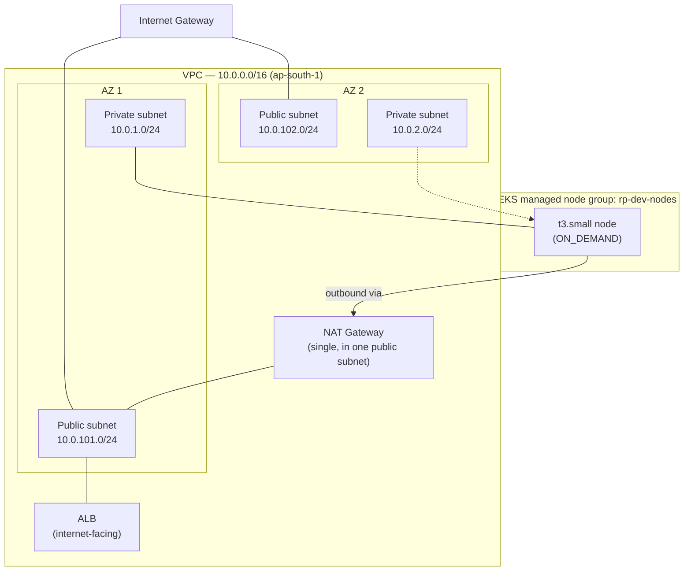
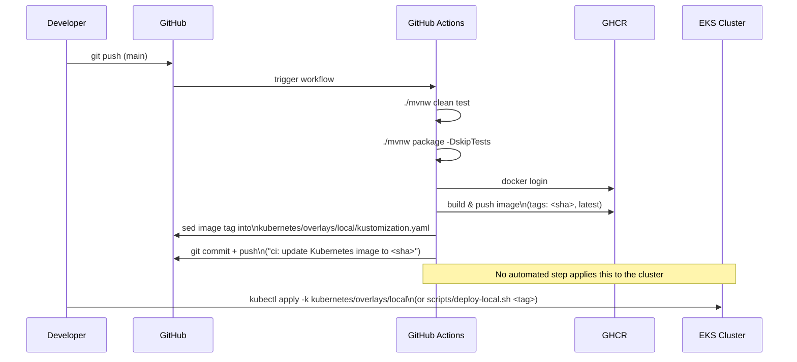
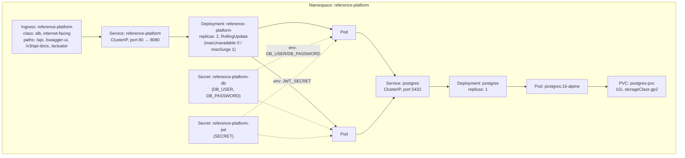
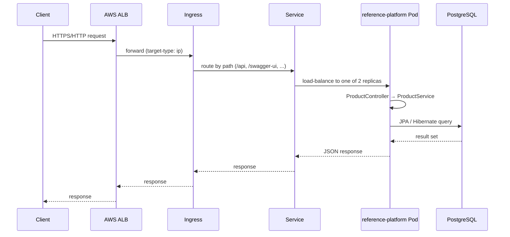

# Architecture

This document goes one level deeper than the README: the AWS network layout, the CI/CD pipeline, the Kubernetes topology, the request path, and the reasoning behind the main design decisions.

All diagrams are Mermaid, so they render natively on GitHub.

---

## 1. AWS network

The VPC and EKS cluster are provisioned by Terraform (`terraform/main.tf`, `terraform/eks.tf`) using the `terraform-aws-modules/vpc` and `terraform-aws-modules/eks` modules.



**Key Terraform decisions:**
- **2 availability zones** — minimum for a resilient VPC/subnet layout without over-provisioning.
- **Single NAT gateway** (not one per AZ) — a deliberate cost trade-off for a dev/portfolio environment; a production setup would use one NAT gateway per AZ to avoid a cross-AZ single point of egress failure.
- **EKS worker nodes live in private subnets**; only the ALB (created by the AWS Load Balancer Controller) sits in the public subnets.
- **Both public and private API server endpoint access are enabled** on the EKS cluster (`endpoint_public_access = true`, `endpoint_private_access = true`) — convenient for `kubectl` from a laptop during development; a hardened setup would restrict the public endpoint to specific CIDRs or disable it in favor of a bastion/VPN.
- **IRSA (IAM Roles for Service Accounts) is enabled** on the cluster, which is what lets in-cluster components (like the AWS Load Balancer Controller) assume scoped IAM roles instead of using node-wide permissions.

---

## 2. CI/CD pipeline

`.github/workflows/ci.yml` runs on every push/PR to `main`.



This is **continuous integration + continuous delivery of a manifest**, not full continuous *deployment*. The pipeline gets a tested, built, pushed image and an up-to-date manifest into Git automatically; getting that manifest applied to the live cluster is still a manual or scripted (`scripts/deploy-local.sh`) step. A natural next iteration is a GitOps controller (Argo CD / Flux) watching the `kubernetes/` path, or an explicit `kubectl apply` job in CI.

---

## 3. Kubernetes topology

Manifests live under `kubernetes/base/` (Deployment, Service, Ingress, Postgres Deployment/Service/PVC) and are composed via Kustomize, with `kubernetes/overlays/local/` overriding the image name and tag.



**Notes:**
- The Deployment defines a **`startupProbe`** (up to 300s of grace via `failureThreshold: 30` × `periodSeconds: 10`) so Spring Boot has time to fully start before liveness/readiness gate traffic — a common fix for Spring Boot pods getting killed too early on slower nodes.
- **Resource requests/limits** are set (`100m`/`128Mi` request, `500m`/`512Mi` limit) so the scheduler has real bin-packing data, rather than being left unbounded.
- The two Secrets referenced by the Deployment (`reference-platform-db`, `reference-platform-jwt`) are **still not defined as manifests in this repo**, on purpose — real credentials shouldn't be committed in plaintext. `kubernetes/base/secrets.example.yaml` now documents the exact shape both Secrets need to be created in, but the create step itself is still manual (`kubectl apply -f`) — see [Known limitations](../../README.md#known-limitations--whats-not-finished).
- The `postgres` Deployment **now reads its password from the same `reference-platform-db` Secret** the app Deployment uses, instead of a plaintext env var — this was fixed to be consistent.
- **`kubernetes/base/namespace.yaml`**, **`hpa.yaml`** (CPU/memory-based, 2–5 replicas — needs `metrics-server` installed to actually scale), and **`pdb.yaml`** (`minAvailable: 1`) are now part of the base and tracked in Kustomize's `resources:` list.

---

## 4. Request flow



Actuator (`/actuator/health`, `/actuator/prometheus`) is exposed on the same Service/port and would typically be scraped by a Prometheus instance in-cluster or via CloudWatch Container Insights — no scraper is currently deployed in this repo, so metrics are exported but not yet collected anywhere.

---

## 5. Design decisions

| Decision | Why | Trade-off accepted |
|---|---|---|
| **EKS over ECS/Fargate** | Kubernetes is the more transferable, in-demand skill to demonstrate, and gives full control over Ingress, probes, and scheduling. | More operational surface area than a managed container service. |
| **Terraform now covers VPC + EKS + ECR + the LB Controller's IAM role** | Started as VPC/EKS-only; ECR and the controller's IAM role were added once it was clear they're exactly the kind of thing worth being reproducible. | The controller's *installation* (Helm) and namespace creation are still manual — only its IAM identity is Terraform-managed. |
| **Kustomize over Helm** | Simpler mental model for a single-app repo; no templating engine needed for one deployment. | Less reusable than a Helm chart if this becomes a multi-environment/multi-app platform. |
| **GHCR over ECR for CI push (still true today)** | Zero extra AWS IAM setup from GitHub Actions — `GITHUB_TOKEN` is enough. | `terraform/ecr.tf` makes an ECR repo available, but CI hasn't been switched to use it yet — that's a deliberate, separate follow-up, not an oversight. |
| **Single NAT gateway** | Meaningfully cheaper for a dev/portfolio environment (one NAT gateway vs. one per AZ). | A single point of egress failure across AZs — not what you'd choose for production. |
| **Secret creation stays manual, but is now documented** | Avoids ever committing real credentials to Git, while `secrets.example.yaml` gives a tracked, reviewable template for what to create. | Still no *automated* (re)creation — a good candidate for External Secrets Operator or Sealed Secrets. |

---

## 6. Teardown

Because this runs on billable AWS resources (EKS control plane, EC2 nodes, NAT gateway, ALB), the cluster is not meant to be left running. To tear down cleanly:

```bash
# Remove Kubernetes-created AWS resources first (the ALB, if the controller made one)
kubectl delete -k kubernetes/overlays/local

# Then destroy the Terraform-managed infrastructure
cd terraform
terraform destroy
```

Removing the Ingress/Service before `terraform destroy` matters because the ALB and its security groups are created by the AWS Load Balancer Controller *outside* of Terraform's state — `terraform destroy` alone won't clean those up.
